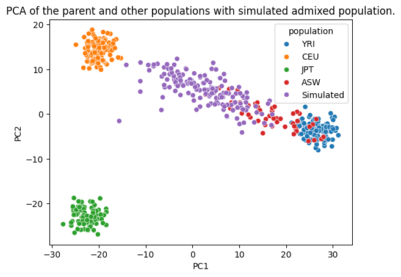
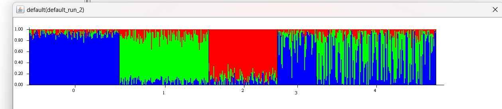
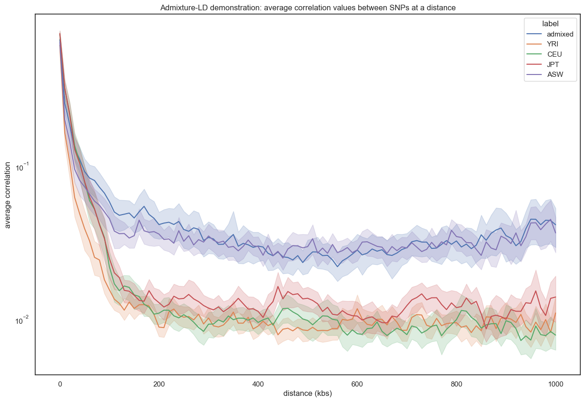

# Statistical-Genetics-Project
contents of the Stat Gen project

### GAUDI Pipeline

- Simulate recombination to generate simulated genotypes, and save ASW, CEU, YRI, and simulated genos to npy files. (sim_recomb_and_save_geno.ipynb)
- Populate VCF files using SNP and GENO information. (geno_to_vcf.ipynb)
- Predict local ancestry probabilities using generated VCF files as input. (flare.sh)
- Parse FLARE output VCF files into npy files. (vcf_to_npy.ipynb)
- Perform GAUDI and normal polygenic risk prediction using original geno files, and local ancestry from FLARE output. (gaudi.ipynb)

### Validation of admixture population results

NOTE: Find data used for these results at: https://drive.google.com/drive/folders/1MPShwoesZ2Ab-hqPpE0naIV_Y69xjVgG?usp=sharing

All contents of this section in the file: `simulated_population_validation.ipynb`.

Includes: 

- PCA on parent and simulated populations.
- Modifying the np array to get it into the input file format for STRUCTURE. STRUCTURE was run using a borrowed windows pc with default settings (MCMC iterations = 3000, K = 3), using just the file produced in the STRUCTURE data modification section of simulated_population_validation.ipynb file (stored in STRUCTURE_input_files/3k_snps_data).
- Computation of Admixture-LD and subsequent plotting for the different populations.

### Results

PCA results were as follows:

STRUCTURE results were as follows:

Admixture LD results were as follows:

### References

- Padhukasahasram, B., Marjoram, P., Wall, J. D., Bustamante, C. D., \& Nordborg, M. (2008). Exploring population genetic models with recombination using efficient forward-time simulations. Genetics, 178(4), 2417–2427. 
- Pritchard, J. K., Stephens, M., \& Donnelly, P. (2000). Inference of population structure using multilocus genotype data. Genetics, 155(2), 945–959. 
- Browning, S. R., Waples, R. K., \& Browning, B. L. (2023). Fast, accurate local ancestry inference with FLARE. American journal of human genetics, 110(2), 326–335. 
- Sun, Q., Rowland, B. T., Chen, J., Mikhaylova, A. V., Avery, C., Peters, U., Lundin, J., Matise, T., Buyske, S., Tao, R., Mathias, R. A., Reiner, A. P., Auer, P. L., Cox, N. J., Kooperberg, C., Thornton, T. A., Raffield, L. M., \& Li, Y. (2024). Improving polygenic risk prediction in admixed populations by explicitly modeling ancestral-differential effects via GAUDI. Nature communications, 15(1), 1016. 
